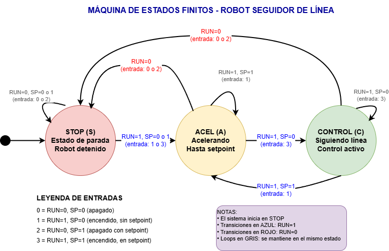

# Proyecto final TD2: Seguidor de Línea con Máquina de Estados

## Descripción

Este proyecto implementa un **seguidor de línea autónomo** basado en un microcontrolador, utilizando una **máquina de estados finitos** para organizar el comportamiento del sistema. El objetivo principal es detectar y seguir una línea sobre una superficie mediante sensores, controlando los motores

El uso de una máquina de estados permite separar el problema en comportamientos bien definidos, facilitando el debug, las pruebas y futuras ampliaciones del sistema.

---

## Estructura del Proyecto

La estructura general del proyecto se organiza de la siguiente manera:

```
/Proyecto-Seguidor-Linea
│
├── src/
│   ├── main.cpp            # Programa principal
│   ├── config.cpp          # Definicion de pines
│   ├── fsm.cpp             # Logica de la Maquina de Estados
│   ├── motores.cpp         # Definicion y Control de Motores
│   ├── interrupciones.cpp  # Definicion de funciones ISR Fisicas, Timer, y Flags  
│   ├── pid.cpp             # Definicion de ctes, sintonizacion Ziegler Nichols y Calculo de PID 
│   └── buzzer.cpp          # Definicion y Control de Buzzer 
│
├── include/                # Archivos de declaracion
│   ├── config.hpp
│   ├── fsm.hpp
│   ├── motores.hpp
│   ├── interrupciones.hpp
│   ├── pid.hpp
│   └── buzzer.hpp
│
├── README.md               # Documentacion del proyecto
└── platformio.ini          # Configuracion según entorno de desarrollo
```

Cada módulo cumple una función específica, evitando dependencias innecesarias y manteniendo el código desacoplado.

---

## Algoritmo de Funcionamiento

El sistema se basa en un **ciclo principal** que evalúa continuamente los sensores y actualiza el estado del robot según las condiciones detectadas.

### Estados Principales

* **INICIO**: Inicialización de periféricos y variables.
* **DETENIDO**: Robot detenido.
* **ACELERAR**: Aceleracion recta mientras esta centrado en la linea (SETPOINT).
* **CONTROL**: Corrección de trayectoria mientras esta desalineado a la linea.

---

### Diagrama General de Estados

El diagrama completo de la máquina de estados se encuentra en el archivo:
`docs/fsm_diagram.drawio`

Vista previa:



---

### Pasos del Algoritmo

1. Inicializar sensores, motores y variables del sistema.
2. Evaluar el estado actual de la máquina de estados. (RUN y SETPOINT)
3. Ejecutar el estado correspondiente al estado.
4. Leer los sensores de línea.
5. Verificar condiciones de transición entre estados.
6. Actualizar el estado si corresponde.
7. Repetir el ciclo de control.

Este enfoque garantiza un comportamiento determinístico y fácil de analizar.

---

## Autores

* Anibal Navarro
* Nicolas Tejada
* Samuel Sanchez

---

## Observaciones Finales

El diseño modular y el uso de máquina de estados hacen que el proyecto sea escalable, permitiendo agregar nuevos modulos, cambios en el hardware, modos de operación o estrategias de control sin reestructurar el sistema completo.
